# ✅ Deployment Setup Complete!

Your project has been successfully configured for automatic deployment to Google Cloud Run.

## 📋 What Was Done

### 1. GitHub Actions Workflow Created
- File: `.github/workflows/deploy-backend.yml`
- Triggers on: Changes to `backend/` directory, `cloudbuild.yaml`, or the workflow file itself
- Automatically builds and deploys your backend to Cloud Run

### 2. Updated .gitignore
- Excludes `node_modules/` and build artifacts
- Prevents sensitive files like `.env` from being committed
- Ignores Firebase cache and OS-specific files

### 3. Documentation Added
- `GITHUB_DEPLOYMENT_SETUP.md`: Complete guide for setting up the deployment
- `FIX_GOOGLE_ONE_TAP.md`: Google One Tap integration documentation

### 4. Code Pushed to GitHub
- Repository: https://github.com/91Signals/confident360
- Branch: main
- All backend changes and new features included

## 🔧 Next Steps to Enable Auto-Deployment

### Step 1: Create Google Cloud Service Account (5 minutes)

1. Go to [Google Cloud Console](https://console.cloud.google.com)
2. Navigate to **IAM & Admin** > **Service Accounts**
3. Click **Create Service Account**
   - Name: `github-actions-deployer`
4. Add these roles:
   - Cloud Build Editor
   - Cloud Run Admin
   - Service Account User
   - Storage Admin
5. Go to the **Keys** tab
6. Create a new **JSON key**
7. Download the JSON file (keep it safe!)

### Step 2: Add Secret to GitHub (2 minutes)

1. Go to: https://github.com/91Signals/confident360/settings/secrets/actions
2. Click **New repository secret**
3. Name: `GCP_SA_KEY`
4. Value: Paste the entire contents of the JSON file
5. Click **Add secret**

### Step 3: Enable Required GCP APIs (2 minutes)

```bash
gcloud config set project YOUR_PROJECT_ID
gcloud services enable run.googleapis.com cloudbuild.googleapis.com artifactregistry.googleapis.com
```

### Step 4: Test the Deployment

Make a small change to any file in the `backend/` directory:

```bash
# Make a change
echo "# Test deployment" >> backend/README.md

# Commit and push
git add backend/README.md
git commit -m "Test auto-deployment"
git push origin main
```

Then watch the deployment:
1. Go to: https://github.com/91Signals/confident360/actions
2. You should see your workflow running
3. Click on it to see live progress

## 📚 Full Documentation

For detailed instructions, see:
- [GITHUB_DEPLOYMENT_SETUP.md](./GITHUB_DEPLOYMENT_SETUP.md) - Complete deployment setup guide
- [DEPLOYMENT.md](./DEPLOYMENT.md) - Manual deployment instructions

## 🎯 How Auto-Deployment Works

```mermaid
graph LR
    A[Push to GitHub] --> B[GitHub Actions Triggered]
    B --> C[Authenticate with GCP]
    C --> D[Cloud Build]
    D --> E[Build Docker Image]
    E --> F[Push to Container Registry]
    F --> G[Deploy to Cloud Run]
    G --> H[Live on Cloud Run! 🚀]
```



## 🔍 Monitoring

After deployment is set up:
- **GitHub Actions**: https://github.com/91Signals/confident360/actions
- **Cloud Run Console**: https://console.cloud.google.com/run
- **Cloud Build History**: https://console.cloud.google.com/cloud-build/builds

## 🚨 Troubleshooting

### "Permission denied" error
- Verify service account has all required roles
- Check that `GCP_SA_KEY` secret is set correctly in GitHub

### Build fails
- Check `backend/Dockerfile` for errors
- Verify all dependencies in `backend/requirements.txt`
- Review Cloud Build logs in GCP Console

### Deployment succeeds but app doesn't work
- Check Cloud Run logs in GCP Console
- Verify environment variables are set correctly in `cloudbuild.yaml`

## 💡 Tips

1. **Always commit to a feature branch first** when making major changes
2. **Monitor your first few deployments** to ensure everything works
3. **Check Cloud Run logs** if something doesn't work as expected
4. **Set up billing alerts** in GCP to avoid unexpected costs

## 🎉 Success Checklist

- [ ] Service account created in GCP
- [ ] Service account key downloaded
- [ ] `GCP_SA_KEY` secret added to GitHub
- [ ] Required GCP APIs enabled
- [ ] Test deployment successful
- [ ] Cloud Run service is live and responding

---

**Need help?** Check the detailed guides:
- [GITHUB_DEPLOYMENT_SETUP.md](./GITHUB_DEPLOYMENT_SETUP.md)
- [DEPLOYMENT.md](./DEPLOYMENT.md)
